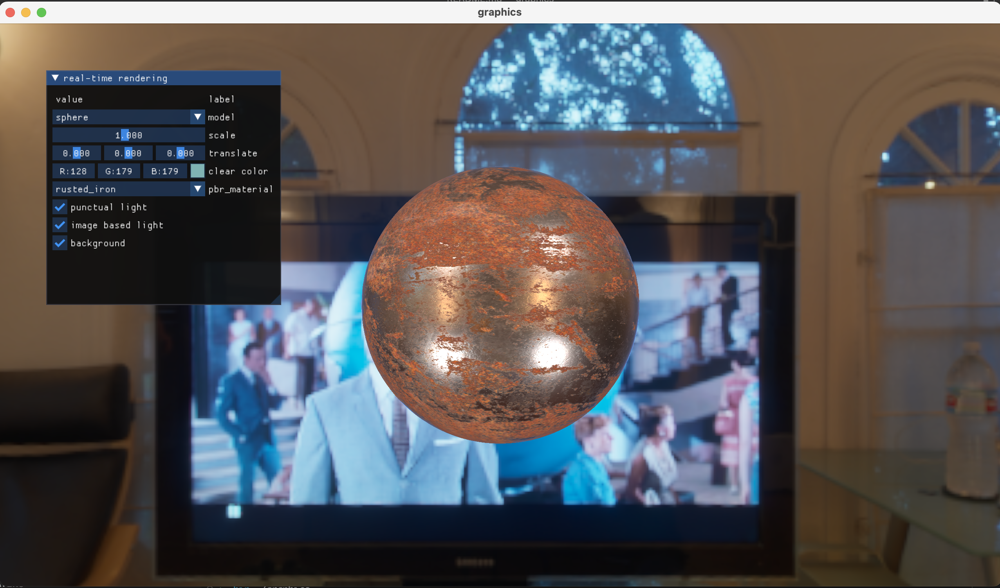
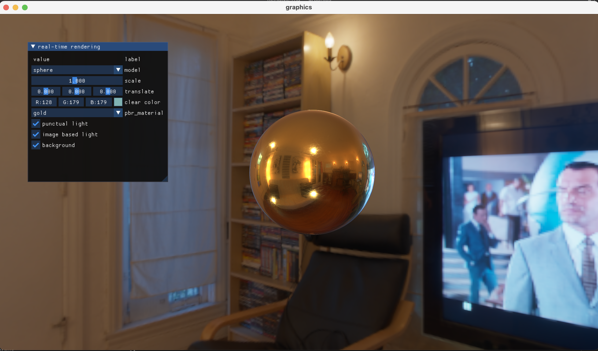

# OpenGL renderer
An OpenGL-based renderer featuring physically based rendering (PBR) and image-based lighting (IBL).

## Prerequisites
The engine targets macOS. The build environment requires the following dependencies:
- glfw
- glew
- glm

These dependencies can be installed manually or through package managers.
```
brew install glfw glew glm
```

## Quick start
```shell
git clone https://github.com/liamhauw/opengl-renderer.git
cd opengl_renderer
cmake -S . -B build
cmake --build build
./bin/graphics
```
The *option* key can be used to hide or show the mouse, *WASD* can move the camera position when the mouse is hidden, the mouse controls the camera orientation, and UI Settings can be made when the mouse is displayed.

# Result


